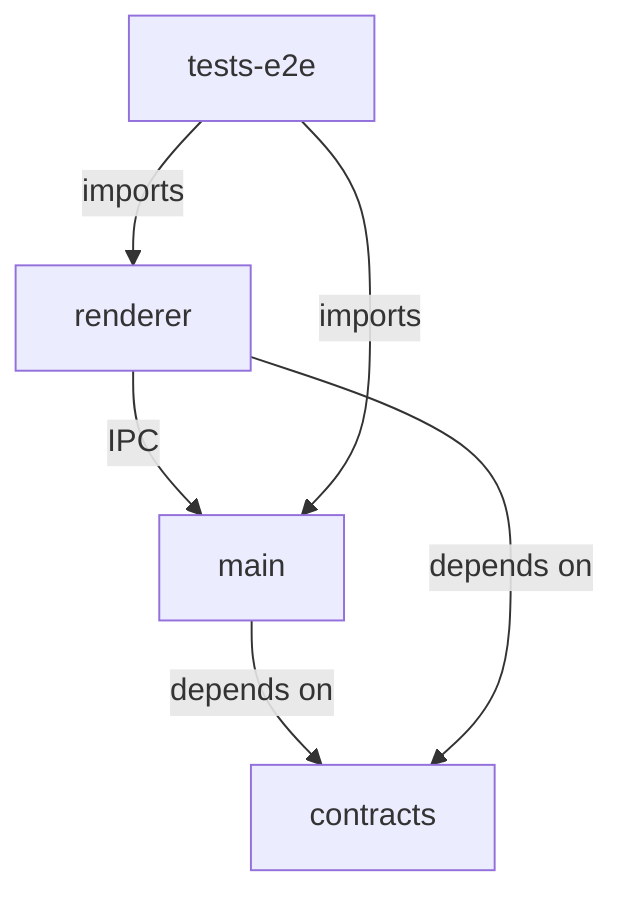

# ClarityOKR 架构审查报告

**审查日期**: 2026-03-23  
**审查范围**: /mnt/d/Code/ClarityOKR  
**审查重点**: 模块化设计、Electron架构、状态管理、数据流、错误边界、性能设计、可测试性

---

## 1. 执行摘要

### 1.1 总体评价
ClarityOKR 项目展现了**相对成熟的 Electron 架构设计**，采用 Monorepo 结构管理多个包，实现了主进程与渲染进程的清晰分离。项目使用了现代化的技术栈（TypeScript 5.x, Angular 17, Electron 30），并在多个方面体现了良好的工程实践。

### 1.2 架构优势
- 清晰的 IPC 通道白名单机制，增强了安全性
- 完善的 TestMode API 支持 E2E 测试
- 使用 Zod 进行运行时类型验证
- 实现了熔断器和缓存机制保护 LLM API 调用
- 崩溃恢复服务保障数据完整性

### 1.3 主要问题
- **IPC 通道定义重复**: 三处定义存在不一致风险
- **内存管理隐患**: 单例模式缺乏生命周期管理
- **错误边界缺失**: 渲染进程无全局错误处理
- **类型安全漏洞**: window.d.ts 使用宽松类型定义
- **资源泄漏风险**: 事件监听器重复注册问题

---

## 2. 模块化设计审查

### 2.1 包结构分析

```
clarityokr/
├── app/
│   ├── main/           # 主进程 (Electron Node.js)
│   └── renderer/       # 渲染进程 (Angular 17)
├── packages/
│   └── contracts/      # 共享契约 (类型定义 + Zod schemas)
└── tests/
    ├── unit/
    ├── integration/
    ├── e2e/
    └── performance/
```

**评分**: 8/10

**优点**:
- 符合 Electron 最佳实践的进程分离
- contracts 包作为单一事实来源 (SSOT)
- 测试分层清晰（单元/集成/E2E/性能）

**问题**:
1. **Workspace 依赖关系**: contracts 包被多处引用，但版本管理依赖 workspace 协议，可能引发版本漂移
2. **循环依赖风险**: renderer 通过 IPC 间接依赖 main 的存储逻辑，边界在概念上清晰但运行时耦合紧密

### 2.2 依赖关系分析



**发现的问题**:
- `app/main/src/bootstrap/ipc-channels.ts` 与 `packages/contracts/src/ipc-channels.ts` 存在**重复定义**
- `app/renderer/src/app/shared/ipc-channel.tokens.ts` 是第三处定义
- 这种重复违反了 DRY 原则，存在通道名称不一致的风险

**建议**:
```typescript
// 应该只从 contracts 包导入
import { IPC_CHANNELS } from '@clarityokr/contracts';
// 而不是在每个包中重新定义
```

---

## 3. Electron 架构审查

### 3.1 主进程架构 (app/main)

**文件**: `/mnt/d/Code/ClarityOKR/app/main/src/main.ts`

**架构模式**: 依赖注入 + 控制器模式

**组件职责**:
```
main.ts                 - 进程入口，依赖组装
windows/
  clarification-controller.ts  - IPC 请求协调器
  sticky-window-manager.ts   - 浮动窗口管理
handlers/               - 具体业务处理器（单一职责）
services/               - 核心业务服务
persistence/            - 数据持久化层
```

**评分**: 8.5/10

**架构亮点**:
1. **ClarificationController** 将 7 个职责拆分到 6 个专门的 Handler 类
2. **SessionManager** 统一管理会话生命周期
3. **依赖注入**通过构造函数实现，便于测试

**代码示例**（良好实践）:
```typescript
// clarification-controller.ts - 清晰的职责分离
constructor(
  sessionRepository: SessionRepository,
  private readonly okrRepository: OkrRepository,
  actionLogWriter: ActionLogWriter,
  private readonly stickyWindowManager: StickyWindowManager,
  okrAgentService: OkrAgentService,
) {
  this.clarificationPromptHandler = new ClarificationPromptHandler(
    this.sessionManager, okrAgentService
  );
  // ... 其他 handlers
}
```

### 3.2 Preload 脚本安全审查

**文件**: `/mnt/d/Code/ClarityOKR/app/main/src/bootstrap/preload.ts`

**安全评分**: 9/10

**优点**:
- 使用 `contextIsolation: true` 和 `sandbox: true`
- 显式 IPC 通道白名单验证
- 通过 `contextBridge` 暴露受控 API

```typescript
const api: ClarifyOkrApi = {
  send: (channel, payload) => {
    validateChannelInternal(channel);  // 白名单验证
    ipcRenderer.send(channel, payload);
  },
  // ...
};
```

**潜在问题**:
- 白名单验证在运行时才执行，应该考虑构建时检查
- 缺少对 payload 的深度验证

### 3.3 窗口管理

**文件**: `/mnt/d/Code/ClarityOKR/app/main/src/windows/sticky-window-manager.ts`

**问题发现**:
1. **内存泄漏风险**: `lastDocument` 引用永不释放
2. **窗口状态不一致**: `alwaysOnTop` 在多处设置
3. **缺少窗口关闭确认**: 用户可能误关窗口丢失数据

**建议修复**:
```typescript
// 添加资源释放
close(): void {
  if (this.window && !this.window.isDestroyed()) {
    this.window.close();
    this.window = null;
  }
  this.lastDocument = null;  // 释放引用
}
```

---

## 4. 状态管理审查

### 4.1 渲染进程状态管理

**文件**: `/mnt/d/Code/ClarityOKR/app/renderer/src/app/clarification/services/sync-clarification-state.service.ts`

**架构演进**: ComponentStore (NgRx) -> Angular Signals

**评分**: 7/10

**架构亮点**:
1. 使用 Angular Signals 实现细粒度响应式
2. 状态修改方法命名清晰，中文注释详细
3. 计算属性 (computed) 封装派生状态

```typescript
// 良好的 Signal 使用
private readonly _currentPrompt = signal<ClarificationPrompt | null>(null);
readonly currentPrompt = this._currentPrompt.asReadonly();
readonly hasPrompt = computed(() => this._currentPrompt() !== null);
```

**问题发现**:

1. **状态重置不一致**:
```typescript
reset(): void {
  this._currentPrompt.set(null);
  // ... 其他重置
  this._history.set([]);  // 历史被清空但可能应该保留
}
```

2. **状态转换逻辑分散**: `workflowState` 的转换逻辑散落在多个方法中，缺乏统一的状态机管理

3. **遗留 API 污染**: 多个 `@deprecated` 方法仍然存在，增加了维护负担

```typescript
// 应该移除的废弃方法
@deprecated Use recordSelection(promptId, optionId) instead
selectOption(optionId: string): void { ... }
```

### 4.2 状态同步问题

**渲染进程状态**与**主进程状态**存在不同步风险:

```typescript
// renderer: 状态在 SyncClarificationState 中
// main: 状态在 SessionManager 中

// 问题：用户刷新页面后，renderer 状态丢失
// 但 main 中 SessionManager 仍有内存缓存
```

**建议**: 实现状态同步机制或采用单一状态源模式

---

## 5. 数据流审查

### 5.1 IPC 通信模式

**当前模式**: 混合使用 invoke/handle 和 send/on

```
Renderer                    Main
--------                    ----
invoke -> CLARIFICATION_PROMPT -> handle (async)
send   -> CLARIFICATION_RESPOND -> on  (fire-and-forget)
```

**问题分析**:

1. **CLARIFICATION_RESPOND 使用 send/on 而非 invoke/handle**:
   - 无确认机制，可能丢失消息
   - 无法处理错误情况
   - 不符合请求-响应语义

**建议**:
```typescript
// 当前实现（有问题）
ipcMain.on(IPC_CHANNELS.CLARIFICATION_RESPOND, (_event, payload) => {
  void handler.handle(payload).catch(...);  // 无返回值
});

// 建议实现
ipcMain.handle(IPC_CHANNELS.CLARIFICATION_RESPOND, async (_event, payload) => {
  return await handler.handle(payload);  // 有返回值和错误传播
});
```

### 5.2 数据流向混乱

**文件**: `/mnt/d/Code/ClarityOKR/app/renderer/src/app/app.component.ts`

**问题**: `onOptionSelected` 方法过于复杂，混合了多个关注点:

```typescript
onOptionSelected(optionId: string): void {
  // 1. 记录选择（同步）
  this.state.recordSelection(prompt.id, optionId);
  
  // 2. 发送选择到主进程
  this.orchestrator.recordSelection(...).subscribe();
  
  // 3. 请求下一个问题（条件判断）
  if (!this.llmBusy) {
    this.llmGateway.getNextQuestion(...).subscribe();
  }
}
```

**违反的原则**:
- 单一职责原则 (SRP)
- 命令查询分离 (CQRS)

**建议**: 将数据流拆分为独立的命令和查询

---

## 6. 错误边界审查

### 6.1 主进程错误处理

**文件**: `/mnt/d/Code/ClarityOKR/app/main/src/main.ts`

```typescript
process.on('uncaughtException', (error) => {
  Logger.error('Uncaught exception in main process', error);
});
```

**问题**:
1. **无进程退出**: 未调用 `app.quit()` 或 `process.exit(1)`
2. **无错误恢复**: 异常后进程继续运行，可能处于不一致状态
3. **未处理 rejection**: 缺少 `unhandledRejection` 处理

**建议**:
```typescript
process.on('uncaughtException', (error) => {
  Logger.error('Uncaught exception in main process', error);
  //  graceful shutdown
  app.quit();
});

process.on('unhandledRejection', (reason) => {
  Logger.error('Unhandled rejection', reason);
});
```

### 6.2 渲染进程错误边界

**严重缺失**: 未发现全局错误边界实现

Angular 应该实现 `ErrorHandler`:

```typescript
// 缺少的实现
@Injectable()
export class GlobalErrorHandler implements ErrorHandler {
  handleError(error: Error): void {
    // 记录错误
    // 报告遥测
    // 显示用户友好的错误界面
  }
}
```

### 6.3 IPC 错误处理不一致

**对比分析**:

| Handler | 错误处理 | 评分 |
|---------|---------|------|
| CLARIFICATION_PROMPT | try-catch + Logger | 良好 |
| CLARIFICATION_RESPOND | .catch() 但无返回 | 差 |
| OKR_GENERATE | 直接抛出 | 一般 |
| LLM_NEXT_QUESTION | try-catch + 验证 | 良好 |

---

## 7. 性能设计审查

### 7.1 缓存机制

**文件**: `/mnt/d/Code/ClarityOKR/app/main/src/services/llm-cache.service.ts`

**设计**: LRU Cache + SHA-256 键生成

**评分**: 8/10

**优点**:
- 使用 `lru-cache` 库，配置合理（100 items, 1h TTL）
- SHA-256 哈希确保键的一致性
- 提供统计信息接口

**问题**:
1. **单例模式**: 无生命周期管理，测试时难以重置
2. **内存无上限**: 虽然限制 100 items，但每个 item 大小未知

### 7.2 熔断器模式

**文件**: `/mnt/d/Code/ClarityOKR/app/main/src/services/llm-circuit-breaker.service.ts`

**设计**: 使用 `opossum` 库包装 LLM API 调用

**配置**:
- failureThreshold: 5
- resetTimeout: 30s
- timeout: 5s

**评分**: 9/10

**优点**:
- 防止级联故障
- 自动恢复机制
- 完善的指标收集

### 7.3 渲染优化

**文件**: `/mnt/d/Code/ClarityOKR/app/renderer/src/app/clarification/components/clarification-wizard.component.ts`

**评分**: 7/10

**优点**:
- 使用 `ChangeDetectionStrategy.OnPush`
- 信号驱动更新

**问题**:
1. **computed 重复计算**: `showWizard()` 在每次变更检测时重新计算
2. **无虚拟滚动**: 历史记录可能无限增长

### 7.4 内存管理问题

**发现的问题**:

1. **事件监听器未清理**:
```typescript
// clarification-orchestrator.service.ts
bridge.on(IPC_CHANNELS.CLARIFICATION_PROMPT, listener);
// 从未调用 bridge.off() 移除监听器
```

2. **单例缓存服务**:
```typescript
// llm-cache.service.ts
static getInstance(): LlmCacheService {
  if (!LlmCacheService.instance) {
    LlmCacheService.instance = new LlmCacheService();
  }
  return LlmCacheService.instance;
}
// 无 destroy() 方法，无法释放内存
```

3. **BehaviorSubject 未完成**:
```typescript
// okr-sticky-gateway.service.ts
private readonly viewModelSubject = new BehaviorSubject<OkrStickyViewModel | null>(null);
// 缺少 ngOnDestroy 完成 subject
```

---

## 8. 可测试性审查

### 8.1 TestMode API

**文件**: `/mnt/d/Code/ClarityOKR/app/main/src/test-mode.ts`

**评分**: 9/10

**架构亮点**:
```typescript
export interface TestModeAPI {
  resetState(): Promise<void>;
  createMockSession(data: Partial<ClarificationSession>): Promise<string>;
  setMockLLMResponse(type: 'nextQuestion' | 'draft', response: unknown): void;
  getCurrentState(): AppState;
  pauseAsyncOperations(): void;
  // ...
}
```

**优点**:
- 完整的状态控制能力
- 异步操作暂停/恢复机制
- Mock LLM 响应注入

### 8.2 依赖注入设计

**良好示例**:
```typescript
export class ClarificationPromptHandler {
  constructor(
    private readonly sessionManager: SessionManager,
    private readonly okrAgentService: OkrAgentService,
  ) {}
}
```

### 8.3 测试基础设施

**E2E 测试配置** (`tests/e2e/playwright.config.ts`):
- 优化的 CI 配置
- 全局 setup/teardown
- 合理的超时设置

### 8.4 可测试性问题

1. **硬编码依赖**: 
```typescript
// okr-agent.service.ts
private readonly cfg = getLlmConfig();
// 无法在不修改环境变量的情况下 mock
```

2. **单例难以 mock**:
```typescript
this.cache = LlmCacheService.getInstance();
// 无法注入 mock cache
```

3. **Electron API 直接依赖**:
```typescript
private readonly elect: typeof electron = electron;
// 虽然可注入，但默认直接使用真实 electron
```

---

## 9. 违反最佳实践汇总

### 9.1 严重问题 (必须修复)

| 问题 | 位置 | 影响 |
|------|------|------|
| IPC 通道重复定义 | 3 处定义 | 维护风险、不一致 |
| 无全局错误边界 | renderer | 用户看到白屏 |
| 事件监听器泄漏 | orchestrator | 内存泄漏 |
| 单例无生命周期 | cache service | 测试污染 |

### 9.2 中等问题 (建议修复)

| 问题 | 位置 | 影响 |
|------|------|------|
| CLARIFICATION_RESPOND 使用 fire-and-forget | handlers | 消息丢失 |
| window.d.ts 宽松类型 | shared/window.d.ts | 类型不安全 |
| 废弃方法未移除 | sync-clarification-state | 技术债务 |
| 错误处理不一致 | handlers | 调试困难 |

### 9.3 轻微问题 (可选优化)

| 问题 | 位置 | 影响 |
|------|------|------|
| 中文注释与英文代码混合 | 多处 | 国际化困难 |
| console 直接输出 | logger.ts | 无结构化日志 |
| 硬编码字符串 | 多处 | 难以本地化 |

---

## 10. 重构建议

### 10.1 短期建议 (1-2 周)

1. **统一 IPC 通道定义**
```typescript
// 只保留 packages/contracts/src/ipc-channels.ts
// 删除其他两处定义
```

2. **修复事件监听器泄漏**
```typescript
ngOnDestroy(): void {
  if (this.bridge) {
    this.bridge.off(IPC_CHANNELS.CLARIFICATION_PROMPT, this.listener);
  }
}
```

3. **添加全局错误处理**
```typescript
@Injectable()
export class GlobalErrorHandler implements ErrorHandler {
  handleError(error: Error): void {
    logger.error('Global error', error);
    // 显示错误界面
  }
}
```

### 10.2 中期建议 (1 个月)

1. **重构状态管理为状态机**
```typescript
type StateMachine = 
  | { state: 'idle' }
  | { state: 'loading'; intent: string }
  | { state: 'prompting'; prompt: ClarificationPrompt }
  | { state: 'error'; error: ErrorInfo };
```

2. **统一错误处理模式**
```typescript
// 创建统一的错误处理器
export class IpcErrorHandler {
  static handle(error: unknown): never {
    const normalized = normalizeError(error);
    logger.error('IPC Error', normalized);
    throw normalized;
  }
}
```

3. **实现资源管理器**
```typescript
export class ResourceManager {
  private disposables: Array<() => void> = [];
  
  register(disposable: () => void): void {
    this.disposables.push(disposable);
  }
  
  dispose(): void {
    this.disposables.forEach(d => d());
    this.disposables = [];
  }
}
```

### 10.3 长期建议 (季度)

1. **引入状态管理库**: 考虑使用 Akita 或 Elf 替代手动 Signal 管理
2. **实现遥测系统**: 添加性能指标、错误报告、用户行为分析
3. **模块化拆分**: 将 contracts 包进一步拆分为 domain-specific 包
4. **DDD 重构**: 引入聚合根、领域事件等概念

---

## 11. 架构评分卡

| 维度 | 评分 | 说明 |
|------|------|------|
| 模块化设计 | 8/10 | Monorepo 结构良好，但 IPC 定义重复 |
| Electron 架构 | 8.5/10 | 进程分离清晰，预加载脚本安全 |
| 状态管理 | 7/10 | Signal 使用正确，但缺乏状态机 |
| 数据流 | 6/10 | IPC 模式不一致，存在 fire-and-forget |
| 错误边界 | 5/10 | 主进程有基础处理，渲染进程缺失 |
| 性能设计 | 8/10 | 缓存和熔断器实现良好 |
| 可测试性 | 8/10 | TestMode API 完善，但单例难以 mock |
| **总体** | **7.2/10** | **良好，但有改进空间** |

---

## 12. 关键文件检查清单

### 已检查的关键文件

| 文件路径 | 检查项 | 状态 |
|---------|--------|------|
| `/mnt/d/Code/ClarityOKR/app/main/src/main.ts` | 主进程入口 | 良好 |
| `/mnt/d/Code/ClarityOKR/app/main/src/bootstrap/ipc-channels.ts` | IPC 定义 | **重复** |
| `/mnt/d/Code/ClarityOKR/app/main/src/bootstrap/preload.ts` | 预加载脚本 | 优秀 |
| `/mnt/d/Code/ClarityOKR/app/main/src/windows/clarification-controller.ts` | 控制器 | 良好 |
| `/mnt/d/Code/ClarityOKR/app/main/src/services/okr-agent.service.ts` | LLM 服务 | 良好 |
| `/mnt/d/Code/ClarityOKR/app/main/src/services/llm-circuit-breaker.service.ts` | 熔断器 | 优秀 |
| `/mnt/d/Code/ClarityOKR/app/main/src/persistence/crash-recovery.service.ts` | 崩溃恢复 | 良好 |
| `/mnt/d/Code/ClarityOKR/app/main/src/test-mode.ts` | 测试模式 | 优秀 |
| `/mnt/d/Code/ClarityOKR/packages/contracts/src/ipc-channels.ts` | IPC 定义（源） | 良好 |
| `/mnt/d/Code/ClarityOKR/packages/contracts/src/validators/clarify-to-okr.validator.ts` | Zod schemas | 良好 |
| `/mnt/d/Code/ClarityOKR/app/renderer/src/app/clarification/services/sync-clarification-state.service.ts` | 状态管理 | 一般 |
| `/mnt/d/Code/ClarityOKR/app/renderer/src/app/app.component.ts` | 根组件 | 需重构 |

---

## 13. 结论

ClarityOKR 项目展现了**成熟的 Electron 应用架构**，在安全性、测试性和性能优化方面都有良好的设计。主要问题集中在:

1. **维护性**: IPC 通道定义的重复
2. **稳定性**: 缺少全局错误边界和资源泄漏风险
3. **一致性**: 错误处理模式不统一

通过实施本报告中的建议，项目可以达到**生产级质量标准**。

---

**报告生成时间**: 2026-03-23  
**审查工具**: 静态代码分析 + 架构模式审查  
**审查者**: AI Architecture Reviewer
