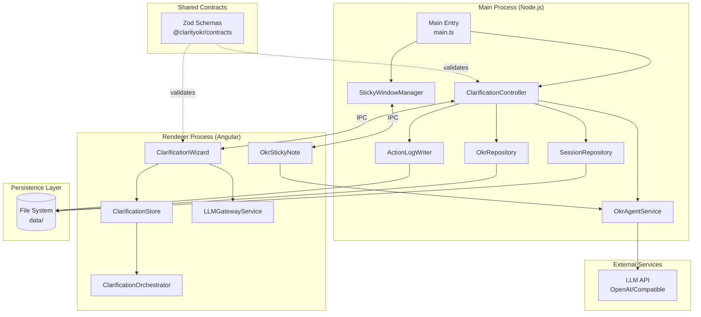
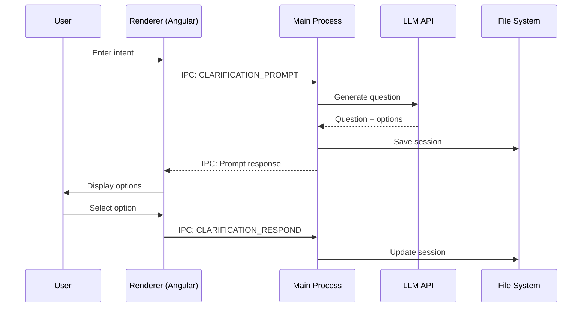
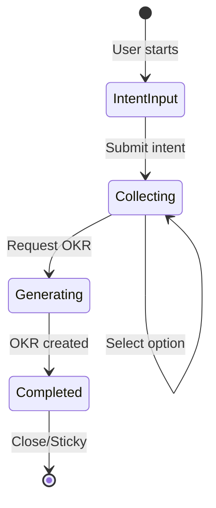
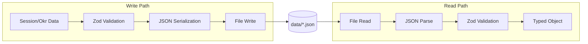

# ClarityOKR Architecture

## System Overview

ClarityOKR is an Electron desktop application that transforms fuzzy intent into structured OKRs through an AI-guided clarification flow.



## Process Architecture

Electron follows a multi-process model with distinct responsibilities:

### Main Process (Node.js)

- **Entry Point**: `app/main/src/main.ts`
- **Responsibilities**:
  - Window lifecycle management
  - IPC handler registration
  - File system operations
  - LLM API communication
  - Native OS integration

### Renderer Process (Angular)

- **Entry Point**: `app/renderer/src/main.ts`
- **Responsibilities**:
  - UI rendering
  - User interaction handling
  - State management (ComponentStore)
  - IPC communication to main process

### Communication Pattern



## Data Flow

### Clarification Flow



### Persistence Flow



## Technology Stack

| Layer           | Technology                | Purpose                       |
| --------------- | ------------------------- | ----------------------------- |
| Runtime         | Node.js 20.x, Electron 30 | Desktop app runtime           |
| Frontend        | Angular 17, RxJS 7        | UI framework                  |
| State           | @ngrx/component-store     | Lightweight state management  |
| Validation      | Zod                       | Runtime type validation       |
| Testing         | Jest, Playwright          | Unit + E2E testing            |
| Build           | esbuild, Angular CLI      | Bundling and compilation      |
| Package Manager | pnpm 9                    | Monorepo workspace management |

## File Structure

```
app/
├── main/                     # Electron main process
│   src/
│   ├── main.ts              # Entry point
│   ├── bootstrap/           # IPC channel definitions
│   ├── persistence/         # Data storage layer
│   │   ├── session-repository.ts
│   │   ├── okr-repository.ts
│   │   ├── action-log-writer.ts
│   │   └── utils.ts         # Shared persistence utilities
│   ├── services/            # Business logic
│   │   └── okr-agent.service.ts
│   └── windows/             # Window controllers
│       ├── clarification-controller.ts
│       └── sticky-window-manager.ts
│
├── renderer/                # Angular renderer
│   src/
│   ├── app/
│   │   ├── clarification/   # Clarification flow
│   │   │   ├── components/
│   │   │   └── services/
│   │   └── okr-sticky/      # Sticky note window
│   └── main.ts
│
packages/
└── contracts/               # Shared TypeScript + Zod
    └── src/
        └── index.ts

tests/
├── unit/                    # Unit tests
├── component/               # Angular component tests
├── integration/             # Integration tests
├── e2e/                     # Playwright E2E
└── performance/             # Performance benchmarks

data/                        # Runtime storage (gitignored)
├── session.json
├── okr/
└── action-log.ndjson
```

## Key Design Decisions

### 1. Monorepo with Shared Contracts

**Decision**: Use a single `@clarityokr/contracts` package for all type definitions.

**Rationale**:

- Single source of truth for IPC contracts
- Zod schemas provide runtime validation
- Eliminates type drift between processes

### 2. File-Based Persistence

**Decision**: Use JSON files for session and OKR storage instead of a database.

**Rationale**:

- Simple deployment (no database setup)
- Human-readable for debugging
- Sufficient for single-user desktop app

### 3. IPC Communication Pattern

**Decision**: Use typed IPC channels with Zod validation on both ends.

**Rationale**:

- Type safety across process boundary
- Fail-fast on invalid payloads
- Clear contract documentation

### 4. Component Store for State

**Decision**: Use `@ngrx/component-store` instead of full NgRx.

**Rationale**:

- Lighter weight for small state needs
- Local component state management
- RxJS-based, fits Angular patterns

### 5. E2E Testing with Mock LLM

**Decision**: Mock LLM responses via local HTTP server in E2E tests.

**Rationale**:

- Deterministic, repeatable tests
- No external API dependencies
- Fast test execution

## IPC Channels

| Channel                 | Direction       | Purpose                           |
| ----------------------- | --------------- | --------------------------------- |
| `CLARIFICATION_PROMPT`  | Renderer → Main | Request next clarification prompt |
| `CLARIFICATION_RESPOND` | Renderer → Main | Submit user's option selection    |
| `OKR_GENERATE`          | Renderer → Main | Generate final OKR document       |
| `LLM_NEXT_QUESTION`     | Renderer → Main | Get next LLM-generated question   |
| `LLM_GENERATE_DRAFT`    | Renderer → Main | Generate OKR draft from context   |
| `OKR_LATEST`            | Renderer → Main | Fetch most recent OKR             |
| `STICKY_REOPEN`         | Renderer → Main | Reopen sticky note window         |

## Error Handling Strategy

1. **Validation Layer**: Zod schemas reject malformed data at boundaries
2. **IPC Error Propagation**: Main process errors serialize to renderer
3. **User Feedback**: Error UI with retry options for recoverable failures
4. **Logging**: Action log records all significant events for debugging
